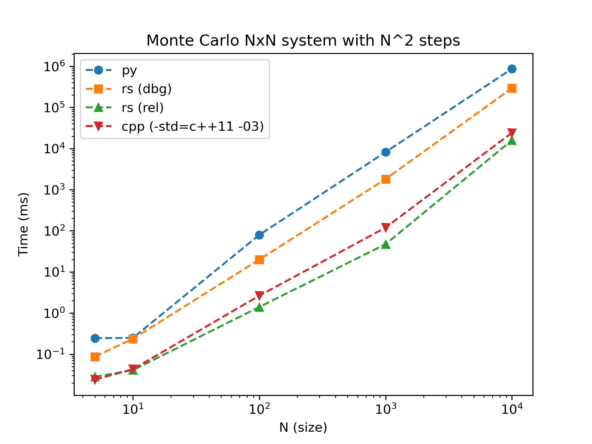

# rsimc

A rust simulator for Monte Carlo systems. Initially built of off the Ising model, this is both an executable and a library that can be used in other systems.

## Build

```
cargo build
```

### Run

You can either use cargo to run or run the executable natively

```
cargo run -- -d 20
```

or 

```
./target/build/debug/rsimc -d 20
```

### Configure simulation

*TBD*

Ideally, the input is intended to use a [toml](https://toml.io/en/) to set up the parameters of the simulation. An example of this would be,

```
cargo run - example/config.toml
```

```
cd target/release
./rsimc $PRJ_ROOT/example/config.toml
```

## Benchmark

We compare a slightly optimized python implementation of the same algorithm to both a debug and release version of the rust equivalent. You can see below that we get about 3x or 54x the speed improvement when using *debug* or *release* mode respectively.



A *lazy* C++ implementation was added, which *should* be comparable in speed to the rust equivalent. We used ChatGPT4 to rewrite the python code implementation to the `-std=c++11` and keep external packages to a minimum. Note that this does not take into account any development hurdles. As the rust implementation was only compiled once, with only one *quasi bug* due to how the modulus `%` operator was assumed to work, which really was a remainder operator. With rust, we needed `a.rem_euclid(b)` for the equivalent `a % b` operation.

Rust seems to preform equivalent up to 2.5x faster, with the peak difference at a system size of N=1000.
